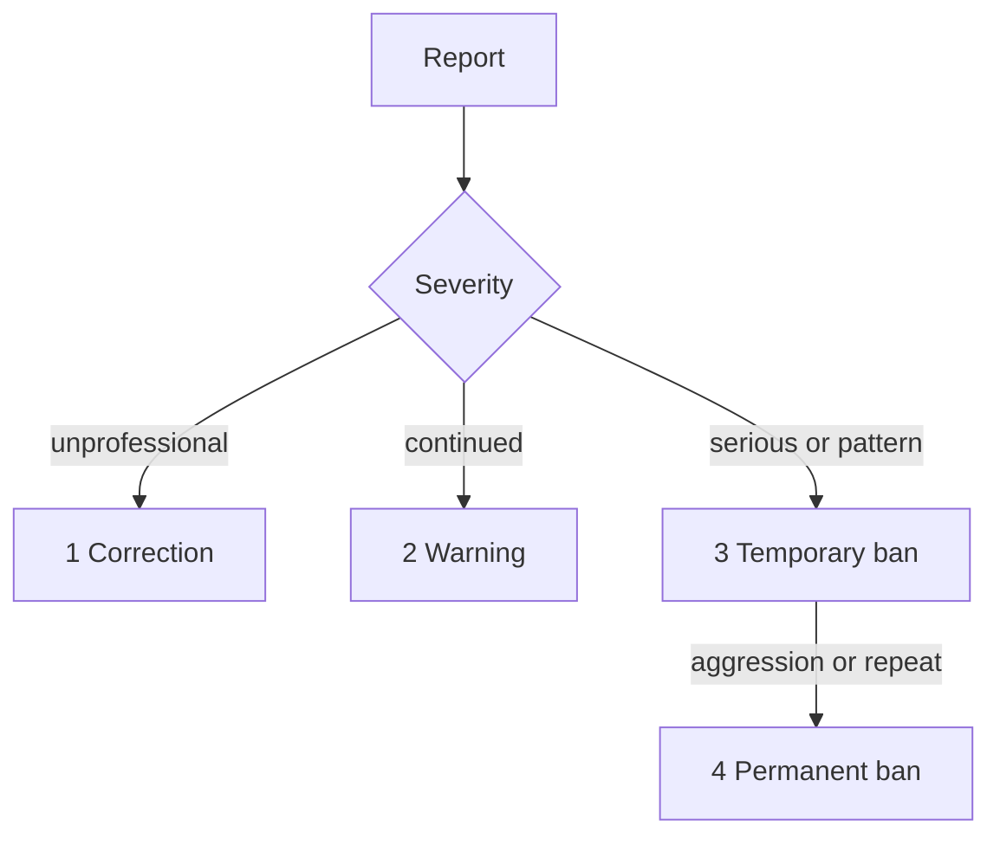

# Contributor Covenant Code of Conduct

  

> [!NOTE]
> This is the social contract for Brim spaces (issues, PRs, discussions, chat). Enforcement contact: [SECURITY.md](SECURITY.md).

## Our Pledge

We as members, contributors, and leaders pledge to make participation in our
community a harassment-free experience for everyone, regardless of age, body
size, visible or invisible disability, ethnicity, sex characteristics, gender
identity and expression, level of experience, education, socio-economic status,
nationality, personal appearance, race, caste, color, religion, or sexual
identity and orientation.

We pledge to act and interact in ways that contribute to an open, welcoming,
diverse, inclusive, and healthy community.

## Our Standards

| Contributes | Unacceptable |
|---|---|
| Empathy and kindness | Sexualised language or imagery; sexual attention or advances of any kind |
| Respect for differing opinions | Trolling, insulting or derogatory comments; personal or political attacks |
| Giving and gracefully accepting feedback | Public or private harassment |
| Responsibility and apology when we get it wrong | Publishing others' private information without explicit permission |
| Focusing on what is best for the community | Other conduct reasonably considered inappropriate in a professional setting |

## Enforcement Responsibilities

Community leaders are responsible for clarifying and enforcing our standards of
acceptable behavior and will take appropriate and fair corrective action in
response to any behavior that they deem inappropriate, threatening, offensive,
or harmful.

## Scope

This Code of Conduct applies within all community spaces, and also applies when
an individual is officially representing the community in public spaces.

## Enforcement

Report incidents to the project maintainers via the contact in [SECURITY.md](SECURITY.md).
All complaints will be reviewed and investigated promptly and fairly.

## Enforcement Guidelines

1. **Correction** — private warning for unprofessional behaviour.
2. **Warning** — consequences for continued behaviour, including a no-interaction period.
3. **Temporary ban** — temporary ban from community interaction.
4. **Permanent ban** — permanent ban for pattern of violation or aggression.

## Attribution

This Code of Conduct is adapted from the [Contributor Covenant](https://www.contributor-covenant.org),
version 2.1.
