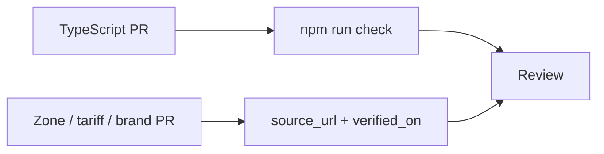

# Contributing to Brim

<p align="center">
  
  
  
</p>

> [!CAUTION]
> **npm only.** Do not use pnpm or yarn. There must be no `pnpm-lock.yaml` or `yarn.lock` at the repo root.

> [!WARNING]
> Do not put registration marks, API keys, or personal data in the diff, fixtures, tests, or commit messages.

---

## Paths in



You do **not** need to write TypeScript to help. Data PRs that correct a clean-air zone, add a brand canonicalisation, or update an EV public-network tariff are first-class.

---

## Fixture mode

Zero API keys:

```bash
npm install
npm run dev:fixtures
```

| | |
|---|---|
| Web | [http://localhost:5173](http://localhost:5173) |
| API | [http://localhost:8787](http://localhost:8787) · Vite proxies `/v1` |

`BRIM_FIXTURES=1` is read at the **API boundary only** — never inside `packages/engine`. Every new external call must add a fixture in the same change.

<details>
<summary>What “fixture in the same change” looks like</summary>

```diff
+ packages/shared/src/fixtures/…   // recorded payload
+ apps/api/src/….ts                // branch that reads BRIM_FIXTURES
+ apps/api/src/….test.ts           // covers the fixture path
```

</details>

---

## Engine purity

`packages/engine` is a calculator, not a service. It imports only `packages/shared`.

| Forbidden in `packages/engine` | Do this instead |
|---|---|
| `fetch` | Caller gathers, passes in |
| `Date.now()` | Pass `now` as an argument |
| `process.env` / Cloudflare bindings | Pass prices, keys never |
| `fs` | Not a data loader |

If a change seems to need I/O, **stop and ask** — the design is wrong. See [ADR 0001](docs/adr/0001-engine-purity.md).

---

## Data contributions

Include `source_url` and `verified_on` (ISO date) on zone and toll records. `data:verify-zones` fails CI when a zone has not been re-verified in 180 days.

| Kind | Where |
|---|---|
| Clean-air / charge zones | `data/zones/` |
| Brand names | canonicalisation tables |
| EV public-network tariffs | `data/tariffs/` |

Open a [Data correction](https://github.com/Hum2a/Brim/issues/new?template=data-correction.yml) issue if you would rather not send a PR.

---

## Commit messages

[Conventional Commits](https://www.conventionalcommits.org/):

```
feat: add arrival state-of-charge verdicts
fix: widen confidence band when road composition is missing
docs: explain fixture mode in README
```

---

## Checks

```bash
npm run check
npm run rules:check
npm run doctor
```

| Command | Gate |
|---|---|
| <kbd>npm run check</kbd> | typecheck · lint · test |
| <kbd>npm run rules:check</kbd> | generated agent files match `AGENTS.md` |
| <kbd>npm run doctor</kbd> | toolchain |
| <kbd>npm run test:rls</kbd> | Postgres RLS (needs a DB) |

If you edit `AGENTS.md`, run <kbd>npm run rules:sync</kbd> so Cursor/Claude copies do not drift.

---

## Workers

On Cloudflare Workers, `env` exists only for the current request:

```ts
// correct
app.post("/v1/estimate", async (c) => {
  const db = createDb(c.env.DATABASE_URL);
  const auth = createAuth(c.env);
});
```

```ts
// forbidden — looks fine locally, dies in production
const db = createDb(process.env.DATABASE_URL);
```

Deploy is **one Worker** per environment (SPA assets + `/v1`): <kbd>npm run deploy:staging</kbd> / <kbd>deploy:prod</kbd>.

---

## Code of conduct

[Contributor Covenant](CODE_OF_CONDUCT.md). Security reports: [SECURITY.md](SECURITY.md).
