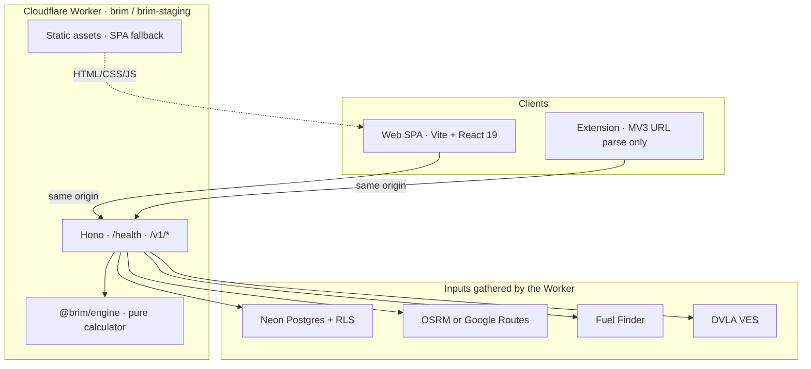
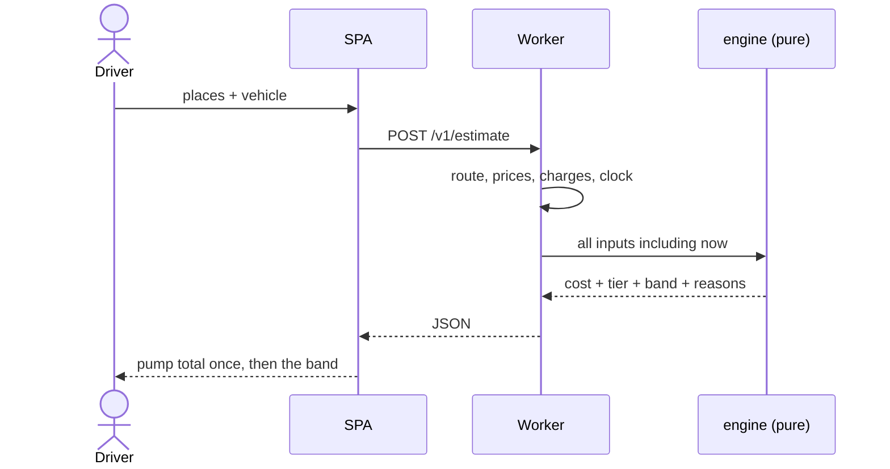

<p align="center">
  
</p>

<h1 align="center">Brim</h1>

<p align="center">
  <strong>True journey cost for UK drivers</strong> — fuel or energy, tolls, and clean-air charges,<br/>
  for the vehicle on your driveway, at the prices you will actually pay.
</p>

<p align="center">
  <a href="https://brim.humza-butt.space">Production</a>
  ·
  <a href="https://brim-staging.humza-butt.space">Staging</a>
  ·
  <a href="docs/README.md">Docs</a>
  ·
  <a href="CONTRIBUTING.md">Contribute</a>
  ·
  <a href="SECURITY.md">Security</a>
</p>

<p align="center">
  <a href="https://github.com/Hum2a/Brim/actions/workflows/pr.yml"></a>
  
  
  
  
  
</p>

<p align="center">
  
</p>

> [!IMPORTANT]
> Brim has no ads, no paid tier, and **will never sell journey or location data**. That sentence is a constraint on future decisions, not marketing copy.

> [!WARNING]
> A UK vehicle registration mark is personal data. It never appears in a URL path, query string, log line, analytics event, error report, fixture, test, or commit message. Make/model entry is a first-class path — a reg is never required.

---

## Contents

- [Why the number is the product](#why-the-number-is-the-product)
- [Architecture](#architecture)
- [Quickstart](#quickstart-no-api-keys)
- [Monorepo](#monorepo)
- [Scripts](#scripts)
- [Hard rules](#hard-rules)
- [Documentation](#documentation)
- [Licence](#licence)

---

## Why the number is the product

The arithmetic is cheap. The inputs are not.

| Input | Typical tools | Brim |
| ---: | :--- | :--- |
| Distance | Same | Same (pluggable routing) |
| Consumption | Generic per engine type | Official figure, then **corrected by the driver's fill-ups** |
| Price | National average | Live per-forecourt (Fuel Finder), never faked |
| Charges | Ignored | Tolls, ULEZ, CAZ, Dart Charge against *this* vehicle |

Confidence is a first-class output. Every fallback in the estimate chain reports which **tier**[^tier] it used and **widens the band**. We would rather be approximately right and honest than precisely invented.

$$
[\text{low},\;\text{high}] \supset \text{point}
\quad\text{and the width grows as the tier degrades } 0 \rightarrow 4.
$$

[^tier]: Spec §5.2. Missing optional inputs degrade a tier, append a reason, and still return a result.

---

## Architecture

One **Cloudflare Worker per environment** serves both the SPA and `/v1`. The browser never calls Google, DVLA, or Fuel Finder.





<details>
<summary><strong>Local vs deployed</strong></summary>

| | Local | Staging | Production |
|---|---|---|---|
| Web | Vite <kbd>http://localhost:5173</kbd> (proxies `/v1`) | same Worker | same Worker |
| API | Wrangler <kbd>http://localhost:8787</kbd> | `brim-api-staging` | `brim-api-production` |
| Public URL | — | [brim-staging.humza-butt.space](https://brim-staging.humza-butt.space) | [brim.humza-butt.space](https://brim.humza-butt.space) |
| Fixtures | `npm run dev:fixtures` | `BRIM_FIXTURES=1` | live |

</details>

---

## Quickstart (no API keys)

```bash
npm install
npm run dev:fixtures
```

Then open [http://localhost:5173](http://localhost:5173). Fixture mode serves recorded responses so you can contribute without a Google billing account.

```diff
# BRIM_FIXTURES is read at the API Worker boundary — never inside packages/engine
+ BRIM_FIXTURES=1
```

> [!TIP]
> Need live keys later? See [self-hosting](docs/self-hosting.md). Every new external call must land a **fixture in the same change**.

---

## Monorepo

npm workspaces + Turborepo. **npm only** — never pnpm or yarn.

```text
apps/web          React 19 + Vite · Brim tokens · cinematic shadcn
apps/api          Hono on Cloudflare Workers · SPA assets + /v1
apps/extension    Manifest V3 · URL parsing, never DOM scraping
packages/engine   PURE calculator · MIT
packages/routing  Providers, polyline, geocode · MIT
packages/shared   Units, fixtures, maps-url · MIT
packages/ui-kit   Radix pieces, tokens, PumpReadout
```

| Package | I/O? | Notes |
|---|---|---|
| `@brim/engine` | **None** | No `fetch`, `Date.now()`, `process.env`, `fs`, or bindings. |
| `@brim/api` | Yes | Per-request `createDb(c.env…)`, `createAuth(c.env…)`. |
| `@brim/web` | Browser only | Talks to `/v1`. No third-party keys. |

---

## Scripts

Named `<domain>:<action>`. Data and database commands go through `scripts/with-env.mjs` so the target environment is **explicit**:

```bash
node scripts/with-env.mjs <dev|staging|prod> -- <command>
```

| Command | What it does |
|---|---|
| <kbd>npm run dev:fixtures</kbd> | API + web, recorded upstream |
| <kbd>npm run dev:web</kbd> / <kbd>dev:api</kbd> / <kbd>dev:ext</kbd> | Individual apps |
| <kbd>npm run check</kbd> | typecheck + lint + test |
| <kbd>npm run doctor</kbd> | local toolchain sanity |
| <kbd>npm run rules:check</kbd> | generated agent files match `AGENTS.md` |
| <kbd>npm run cf:sync:staging</kbd> / <kbd>cf:sync:prod</kbd> | upload Worker secrets (`--yes`) |
| <kbd>npm run deploy:staging</kbd> | one Worker: SPA + API |
| <kbd>npm run deploy:prod</kbd> | same, production env |
| <kbd>npm run size</kbd> | gzip vs the 150 kB initial-JS gate |

---

## Hard rules

These fail review. Full text: [`AGENTS.md`](AGENTS.md).

1. **Engine is pure.** If it needs a network call, the design is wrong.
2. **Per-request factories on Workers.** Never a module-scope DB/auth client.
3. **VRM privacy** — see the warning at the top of this file.
4. **Public repo.** No secrets in source, fixtures, tests, or commit messages.
5. **Script names** are `<domain>:<action>`.
6. **Never fake precision** the inputs do not support.

---

## Documentation

| | |
|---|---|
| [**Docs hub**](docs/README.md) | Index of everything below |
| [Design spec](docs/design-spec.md) | Authoritative product + engineering spec |
| [Self-hosting](docs/self-hosting.md) | Env, Neon, deploy |
| [ADRs](docs/adr/README.md) | Including the §15 UI override |
| [Contributing](CONTRIBUTING.md) | PRs, data, fixtures |
| [Security](SECURITY.md) | Private disclosure |

Kitchen sink (motion lab): `/kitchen-sink` on a running web app.

---

## Licence

| Path | Licence |
|---|---|
| `apps/*` | [AGPL-3.0-or-later](LICENSE) |
| `packages/engine`, `packages/shared`, `packages/routing` | MIT — conversions, correction factors, and charge-window logic can be reused permissively |

See `LICENSE` files in those packages.

---

<p align="center">
  <sub>Dark only. Archivo / Inter Tight / JetBrains Mono. Pump total is the amber hero.</sub>
</p>
