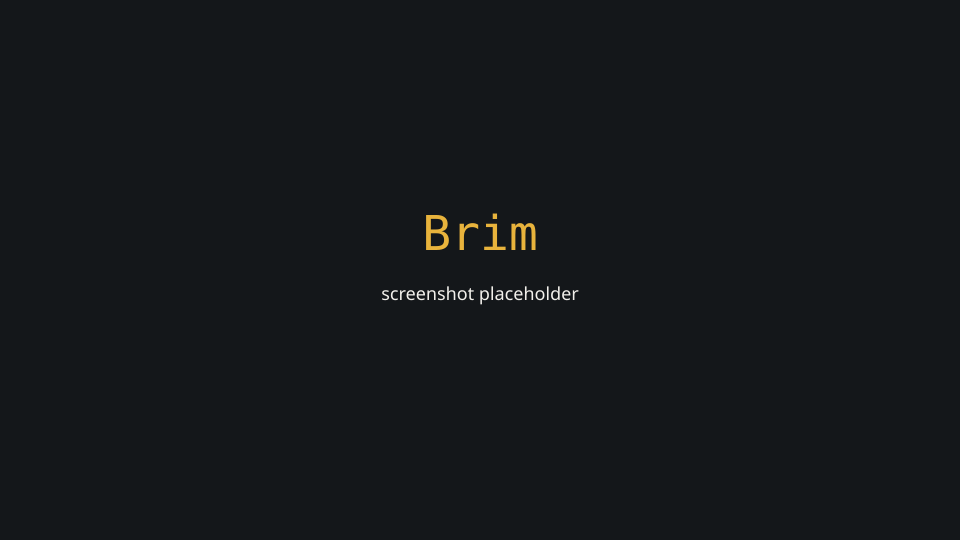

# Brim

True journey cost for UK drivers — fuel or energy, tolls, and clean-air charges, for the vehicle on your driveway, at the prices you will actually pay.



## Licence

`apps/*` is licensed AGPL-3.0-or-later. `packages/engine`, `packages/shared`, and `packages/routing` are MIT, so the conversions, correction factors, and charge-window logic can be reused permissively. See `LICENSE` files in those packages.

## Brim is free

Brim has no ads, no paid tier, and **will never sell journey or location data**. That sentence is a constraint on future decisions, not marketing copy.

## Quickstart (no API keys)

```bash
npm install
npm run dev:fixtures
```

The web app is at http://localhost:5173. The API is at http://localhost:8787. Fixture mode serves recorded responses so you can contribute without a Google billing account.

See [CONTRIBUTING.md](CONTRIBUTING.md) and [docs/self-hosting.md](docs/self-hosting.md).
