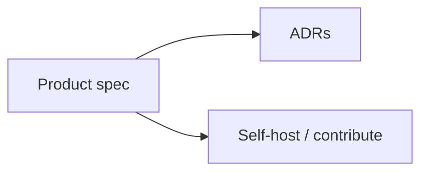

# Documentation

The human-facing map of Brim. Agent rules live in [`AGENTS.md`](../AGENTS.md) (do not edit generated Cursor/Claude copies).

| Document | Role |
|---|---|
| [Design spec](design-spec.md) | **Authoritative.** Code that contradicts it is a bug in one of the two. |
| [Specification v0.2](../brim-specification-v0.2.md) | Source dump the design spec was generated from. |
| [Self-hosting](self-hosting.md) | Fixture mode, env, Workers deploy. |
| [ADR index](adr/README.md) | Dated decisions, including spec overrides. |
| [Build prompts](../brim-build-prompts.md) | Phased P0–P4 Cursor kit. |
| [Contributing](../CONTRIBUTING.md) | npm-only, purity, fixtures, Conventional Commits. |
| [Security](../SECURITY.md) | Private reports. VRMs are personal data. |
| [Code of conduct](../CODE_OF_CONDUCT.md) | Contributor Covenant 2.1. |

> [!IMPORTANT]
> Vehicle registration marks never appear in a URL, query string, log line, analytics event, error report, fixture, or commit message.

> [!NOTE]
> ADR 0003 records a **product override** of spec §15 (glass, extra hues, motion). That is flagged, not silently reconciled.
