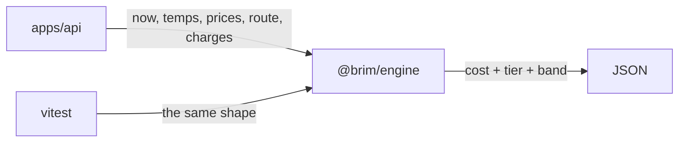

# ADR 0001 — Engine purity

<table>
<tr>
<td><strong>Date</strong></td><td>2026-08-15</td>
</tr>
<tr>
<td><strong>Status</strong></td><td>

</td>
</tr>
<tr>
<td><strong>Supersedes</strong></td><td>—</td>
</tr>
</table>

> [!IMPORTANT]
> `packages/engine` is a **calculator**, not a service. Lint must fail on `fetch`, `Date.now`, `process.env`, `fs`, and Cloudflare bindings.

## Context

Journey cost depends on the current time (charge windows, traffic buckets) and on weather (EV derating). It is tempting to read `Date.now()` or fetch a forecast inside `packages/engine`.

## Decision

The engine takes time, temperature, prices, routes, and charges as **inputs**. It performs no I/O and no clock reads.

## Consequences

Callers (the API, tests, fixtures) gather those values. Tests are deterministic. A Worker isolate cannot accidentally bake in a secret or a clock. Charge-window logic can be tested at DST boundaries without mocking the system clock.

**Index:** [ADR list](README.md)
