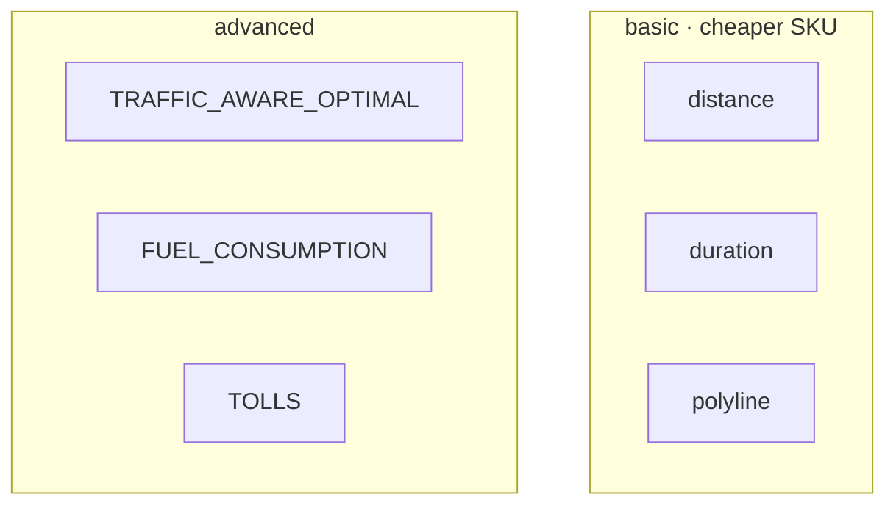

# ADR 0002 — Google Routes API fields

<table>
<tr>
<td><strong>Date checked</strong></td><td>2026-08-15</td>
</tr>
<tr>
<td><strong>Status</strong></td><td>

</td>
</tr>
<tr>
<td><strong>Source</strong></td><td>

[computeRoutes](https://developers.google.com/maps/documentation/routes/reference/rest/v2/TopLevel/computeRoutes)

</td>
</tr>
</table>

## Findings vs spec §6.1

Spec §6.1 is still accurate on the important names:

| Item | Value |
|---|---|
| Endpoint | `POST https://routes.googleapis.com/directions/v2:computeRoutes` |
| `extraComputations` | `FUEL_CONSUMPTION`, `TOLLS` (plus others we will not request) |
| Field mask | `routes.distanceMeters`, `routes.duration`, `routes.polyline.encodedPolyline` |
| Tolls | `travelAdvisory.tollInfo` on route and/or leg — extra computation `TOLLS` required |
| Fuel | Request `routes.travelAdvisory.fuelConsumptionMicroliters`; if omitted, do **not** guess |

## Discrepancies / gaps

> [!WARNING]
> The current Route object has **no road-class composition** (urban / rural / motorway fractions). Report `roadComposition: false` rather than fabricating a breakdown (spec §5.3).

UK toll coverage is still not guaranteed in the API. Advanced mode may request `TOLLS` for the field, but **P7 owns charge amounts** from our own table. If live UK tolls are empty we drop `TOLLS` from extraComputations to save SKU cost.

## Modes

| Mode | Field mask | extraComputations |
|---|---|---|
| `basic` | distance, duration, polyline | none |
| `advanced` | plus fuel + tolls entries | `TRAFFIC_AWARE_OPTIMAL`, `FUEL_CONSUMPTION`, `TOLLS` |

**Index:** [ADR list](README.md)
