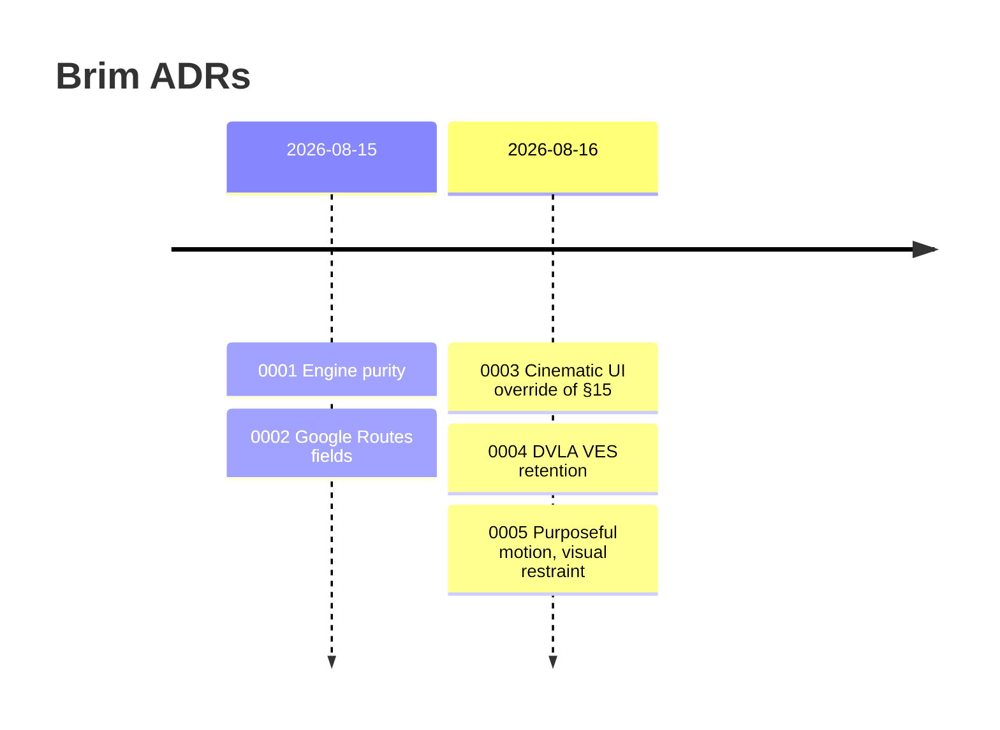

# Architecture Decision Records

Decisions that would otherwise rot in chat. Newest last.

| ADR | Status | One line |
|---|---|---|
| [0001: Engine purity](0001-engine-purity.md) | Accepted | Time, weather, prices, routes, charges are **inputs**. No I/O in `packages/engine`. |
| [0002: Routes API fields](0002-routes-api-fields.md) | Accepted | Spec §6.1 field names still hold; no fabricated road-class mix. |
| [0003: Cinematic UI](0003-cinematic-ui-override.md) | Superseded by 0005 | Cinematic glass/glow pass. Kept as the historical flag. |
| [0004: DVLA VES retention](0004-dvla-ves-retention.md) | Accepted | On-demand VES, no VRM cache, encrypted plate only on signed-in save. |
| [0005: Purposeful motion](0005-purposeful-motion.md) | Accepted (override) | Restores §15 visuals. Allows restrained interaction motion. |

> [!TIP]
> New override of the spec? Add an ADR. Do not edit `AGENTS.md` to paper over the contradiction.
