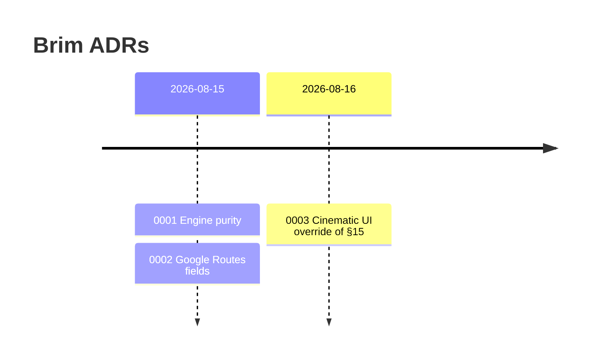

# Architecture Decision Records

Decisions that would otherwise rot in chat. Newest last.

| ADR | Status | One line |
|---|---|---|
| [0001 — Engine purity](0001-engine-purity.md) | Accepted | Time, weather, prices, routes, charges are **inputs**. No I/O in `packages/engine`. |
| [0002 — Routes API fields](0002-routes-api-fields.md) | Accepted | Spec §6.1 field names still hold; no fabricated road-class mix. |
| [0003 — Cinematic UI](0003-cinematic-ui-override.md) | Accepted (override) | Product request beats spec §15 for this pass. Bundle miss vs 150 kB is reported, not hidden. |

> [!TIP]
> New override of the spec? Add an ADR. Do not edit `AGENTS.md` to paper over the contradiction.
