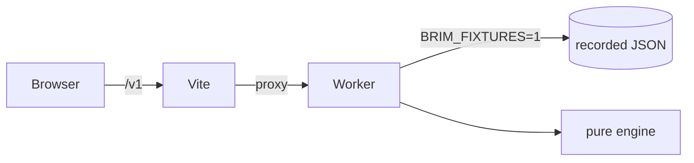
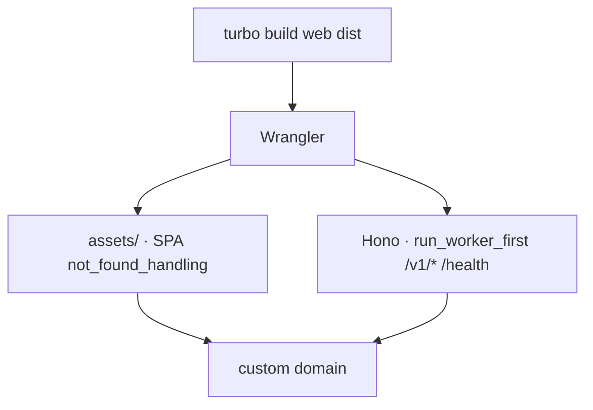

# Self-hosting Brim

<p align="center">
  
</p>

> [!TIP]
> You can run the whole product with **zero third-party keys**. Start there.

> [!CAUTION]
> Charge liability remains with the **driver**. Brim is not authoritative on ULEZ/CAZ/tolls (spec §9B.6). Show the number; do not pretend it is a legal determination.

---

## 1. Requirements

| Need | Version / notes |
|---|---|
| Node | **≥ 20** (CI uses 22) |
| Package manager | **npm only** (`packageManager` is pinned in root `package.json`) |
| Optional DB | Neon Postgres + PostGIS (P4 persistence; fixture/in-memory still works) |
| Optional keys | Google Routes, Fuel Finder, DVLA VES, Resend |

---

## 2. Fixture mode (zero keys)

```bash
npm install
npm run env:setup          # copies *.example → local env files if missing
npm run dev:fixtures
```

| Process | URL |
|---|---|
| Vite | [http://localhost:5173](http://localhost:5173) - proxies `/v1` and `/health` |
| Wrangler | [http://localhost:8787](http://localhost:8787) |

`BRIM_FIXTURES=1` is read **only** in `apps/api`. `packages/engine` never sees it.



---

## 3. Environment files

Never infer the target. Data and DB commands:

```bash
node scripts/with-env.mjs <dev|staging|prod> -- <command>
```

The wrapper **fails loudly** if no environment is given.

<details>
<summary>What lives where</summary>

| File | Git | Purpose |
|---|---|---|
| `.env.example` / `.env.*.example` | committed | Template |
| `.env` / `.env.staging` / `.env.production` | **ignored** | Real values |
| `apps/api/.dev.vars*` | **ignored** except `*.example` | Wrangler local / `env:sync` |
| Wrangler secrets | Cloudflare | Production/staging keys |
| GitHub environments | Actions | `CLOUDFLARE_API_TOKEN`, etc. |

`VITE_API_BASE` is **empty** for deployed builds: the Worker serves the SPA and `/v1` on the same origin. Locally, leave it empty so Vite proxies.

</details>

Sync into Wrangler-shaped files:

```bash
npm run env:sync
npm run env:sync:staging
npm run env:sync:prod
```

Push filled Worker secrets to Cloudflare (names only in the log, never values).
`BRIM_FIXTURES` and `WEB_ORIGIN` stay in `wrangler.jsonc` and apply on deploy.

```bash
npm run cf:sync -- --dry-run
npm run cf:sync:staging -- --yes
npm run cf:sync:prod -- --yes
```

---

## 4. Database (when you leave fixtures)

| Piece | Notes |
|---|---|
| Neon | Postgres; enable PostGIS |
| Drizzle | `npm run db:generate` then `db:migrate:<env>` |
| RLS | `npm run db:force-rls` · `npm run test:rls` |
| Seed | `npm run db:seed` (needs `with-env`) |

Per-request factory only:

```ts
const db = createDb(c.env.DATABASE_URL);
```

---

## 5. Routing provider

| Mode | Provider | Extra SKUs |
|---|---|---|
| Fixtures | Recorded polylines / places | None |
| Basic live | Distance, duration, polyline | Cheaper Routes SKU |
| Advanced live | Traffic, fuel microlitres, tolls field | See [ADR 0002](adr/0002-routes-api-fields.md) |

UK toll **amounts** still come from Brim's table (P7), not from guessing empty Google toll arrays.

Set `OSRM_URL` if you self-host OSRM instead of Google.

---

## 6. Fuel Finder / DVLA / mail

| Secret | Used by | Browser? |
|---|---|---|
| `GOOGLE_MAPS_API_KEY` | Worker only | Never |
| `FUEL_FINDER_CLIENT_ID` / `SECRET` | Worker only | Never |
| `DVLA_VES_API_KEY` | Worker only | Never |
| `RESEND_API_KEY` | Worker only | Never |
| `BETTER_AUTH_SECRET` | Worker only | Never |
| `VRM_ENCRYPTION_KEY` | Worker only | Never |

> [!WARNING]
> Forked PRs must keep running on fixtures. Do not put live keys in the tree so CI can “just work”.

---

## 7. Deploy

One Worker per environment: **static SPA + Hono**.

```bash
npm run cf:sync:staging -- --yes
npm run deploy:staging    # brim-staging.humza-butt.space
npm run cf:sync:prod -- --yes
npm run deploy:prod       # brim.humza-butt.space
```

| Env | Worker name | `BRIM_FIXTURES` |
|---|---|---|
| staging | `brim-api-staging` | `1` |
| production | `brim-api-production` | `0` |



Pages is **not** the production path anymore. Custom domains are Worker custom domains on `humza-butt.space`.

GitHub Actions: [`.github/workflows/staging.yml`](../.github/workflows/staging.yml) (push `main`), [`.github/workflows/production.yml`](../.github/workflows/production.yml) (tags `v*`).

---

## 8. Cron / sync worker

Ingestion (Fuel Finder, zone refresh) belongs in a **scheduled Worker**, not in `packages/engine`. Keep third-party keys on that boundary.

---

## 9. What you are responsible for

| You operate | Drivers still own |
|---|---|
| Keys, uptime, RLS, log redaction | Whether they actually owe a charge |
| Zone `verified_on` freshness | Their vehicle's real compliance |
| Not logging VRMs | The decision to drive |

---

## Related

- [Docs hub](README.md)
- [Contributing](../CONTRIBUTING.md)
- [Design spec](design-spec.md)
